<picture>
  <source media="(prefers-color-scheme: dark)" srcset="dark.svg">
  <source media="(prefers-color-scheme: light)" srcset="light.svg">
  
</picture>

###  About Me
I'm **Harjapan Singh**, an AI & Full-Stack Developer studying at Punjab Engineering College.  
I love building intelligent systems, multi-agent pipelines, and seamless user experiences!

###  Tech Stack & Tools

###  GitHub Stats

 

<picture>
  <source media="(prefers-color-scheme: dark)" srcset="https://raw.githubusercontent.com/HARJAPAN2005/HARJAPAN2005/output/github-contribution-grid-snake-dark.svg">
  <source media="(prefers-color-scheme: light)" srcset="https://raw.githubusercontent.com/HARJAPAN2005/HARJAPAN2005/output/github-contribution-grid-snake.svg">
  
</picture>

 

  
  

